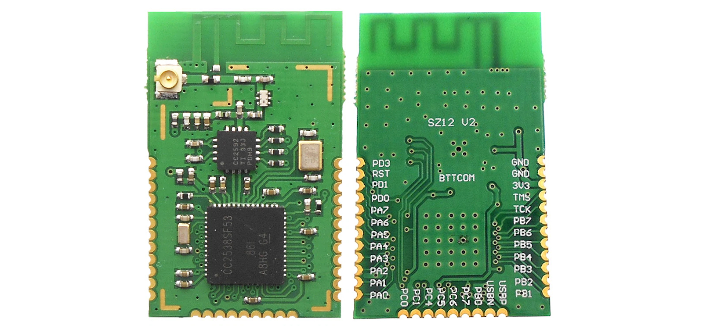
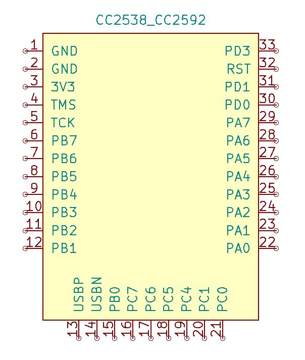
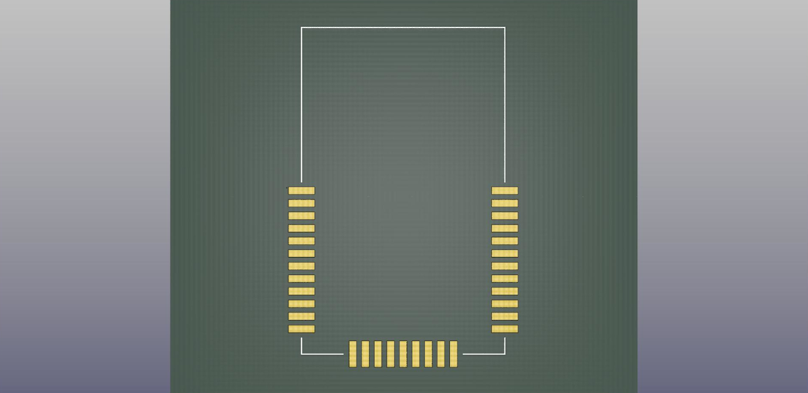
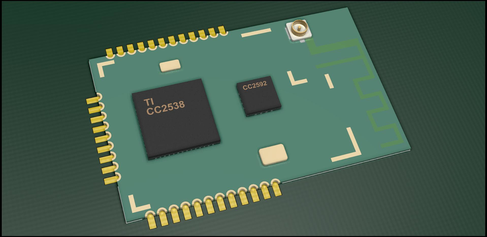
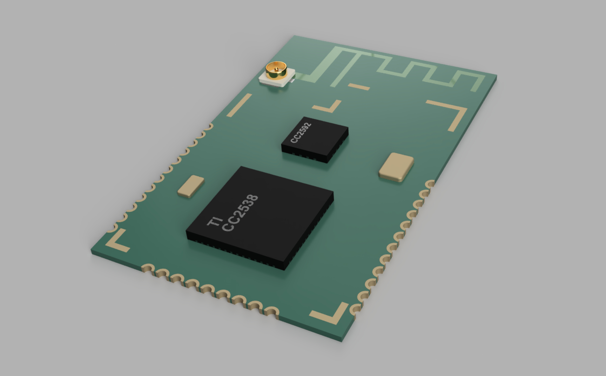
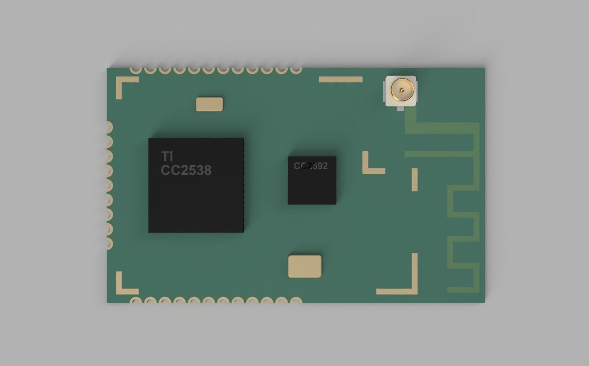
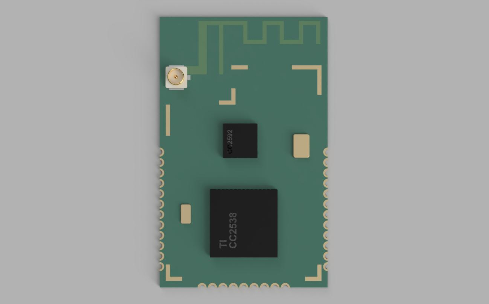

# CC2538-CC2592-kicad-component
This repository contains handmade schematic symbol, pcb footprint, and 3D model for a particular chinese CC2538-CC2592 Zigbee RF module. All files are provided to import the module to Kicad as a new component. 

## Module specification

This zigbee RF unit is pretty common, very cheap and easy-to-get from China. A couple of custom zigbee coordinator designs have been made using this part as a base. The applied CC2538 is a stable, powerful zigbee SoC with USB capability, backed up by CC2592 RF frontend.

| Property | Value |
| -------- | ----- |
| Frequency band | 2.4GHz |
| Input gain | 12dB |
| Receiving current | 30mA |
| Transmission current | <175mA |
| Output power | +20dBm |
| Operating voltage | 3.3V |
| Data rate | 250Kbps |
| Number of channels | 16 |
| Antenna | PCB or IPEX |
| Module size | 20.5mm×33mm |
| Pitch | 1.27mm |

## Kicad representation and renders

## Installation
To be able to work with the module in Kicad, clone this repository, and use Kicad's built-in import functions, or copy the files to the following directories:
| Function | Filename | Directory |
| -------- | -------- | --------- |
| Symbol | cc2538_cc2592.lib+dcm | KiCad\share\kicad\library\ |
| Footprint | CC2538_CC2592.kicad_mod | KiCad\share\kicad\modules\RF_Module.pretty\ |
| 3D Model | CC2538_CC2592.step | KiCad\share\kicad\modules\packages3d\RF_Module.3dshapes\ |
